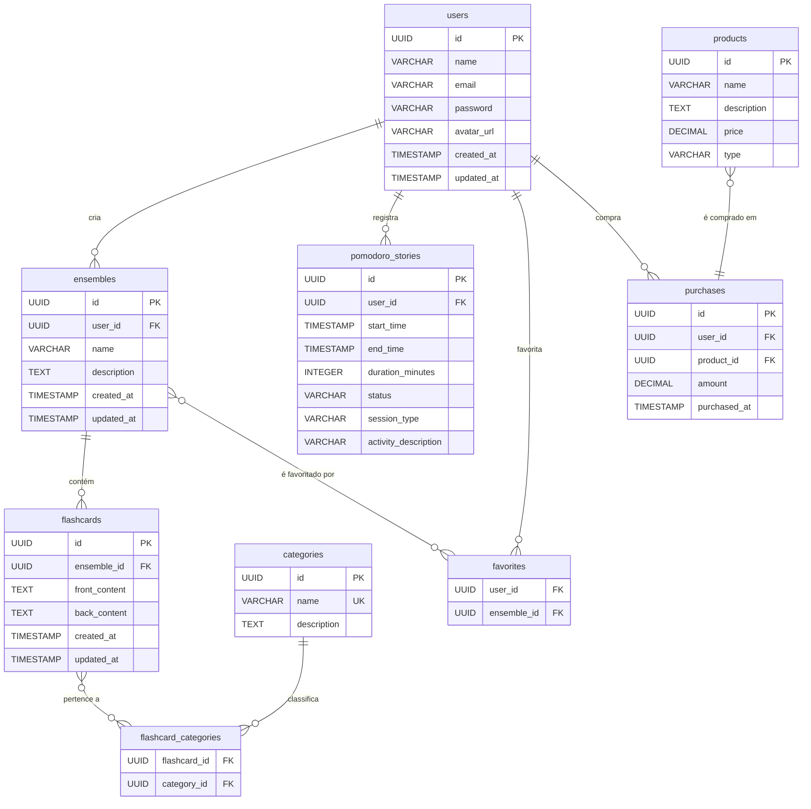

# Modelagem do Banco de Dados - Runecraft Academy

Este documento descreve a estrutura do banco de dados para o projeto Runecraft Academy, incluindo a loja, categorização de flashcards e estatísticas de Pomodoro.

## Diagrama de Entidade e Relacionamento (Mermaid)



---

## Dicionário de Dados

### Tabela: `users`
- `id` (UUID, PK)
- `name`, `email` (UNIQUE), `password`, `avatar_url`
- `created_at`, `updated_at`

### Tabela: `ensembles` (Decks)
- `id` (UUID, PK)
- `user_id` (UUID, FK -> users.id)
- `name`, `description`
- `created_at`, `updated_at`

### Tabela: `flashcards`
- `id` (UUID, PK)
- `ensemble_id` (UUID, FK -> ensembles.id)
- `front_content`, `back_content`
- `created_at`, `updated_at`

### Tabela: `categories`
- `id` (UUID, PK)
- `name` (VARCHAR, UNIQUE): Nome da categoria (ex: "Java", "Spring Boot").
- `description` (TEXT)

### Tabela: `flashcard_categories` (N:N)
- `flashcard_id` (UUID, FK -> flashcards.id)
- `category_id` (UUID, FK -> categories.id)
- `PRIMARY KEY (flashcard_id, category_id)`

### Tabela: `pomodoro_stories`
- `id` (UUID, PK)
- `user_id` (UUID, FK -> users.id)
- `start_time`, `end_time`
- `duration_minutes` (INTEGER)
- `status` (ENUM): 'completed', 'interrupted'.
- `session_type` (ENUM): 'focus', 'short_break', 'long_break'.
- `activity_description` (TEXT)

### Tabela: `favorites` (N:N)
- `user_id` (UUID, FK -> users.id)
- `ensemble_id` (UUID, FK -> ensembles.id)
- `PRIMARY KEY (user_id, ensemble_id)`

### Tabela: `products` (Loja)
- `id` (UUID, PK)
- `name` (VARCHAR)
- `description` (TEXT)
- `price` (DECIMAL)
- `type` (VARCHAR): Ex: 'DECK_UNLOCK', 'THEME', 'FEATURE'.

### Tabela: `purchases`
- `id` (UUID, PK)
- `user_id` (UUID, FK -> users.id)
- `product_id` (UUID, FK -> products.id)
- `amount` (DECIMAL): Preço pago no momento da compra.
- `purchased_at` (TIMESTAMP)

---

## Modelo Físico (PostgreSQL)

```sql
-- SQL Schema for Runecraft Academy Database
-- Version: 2.1
-- Last Updated: 2025-07-16

-- Enable UUID generation
CREATE EXTENSION IF NOT EXISTS "uuid-ossp";

-- Function to auto-update 'updated_at' timestamp
CREATE OR REPLACE FUNCTION update_updated_at_column()
RETURNS TRIGGER AS $
BEGIN
   NEW.updated_at = NOW();
   RETURN NEW;
END;
$ language 'plpgsql';

-- Table: users
CREATE TABLE users (
    id UUID PRIMARY KEY DEFAULT uuid_generate_v4(),
    name VARCHAR(255) NOT NULL,
    email VARCHAR(255) NOT NULL UNIQUE,
    password VARCHAR(255) NOT NULL,
    avatar_url VARCHAR(255),
    created_at TIMESTAMP WITH TIME ZONE DEFAULT CURRENT_TIMESTAMP,
    updated_at TIMESTAMP WITH TIME ZONE DEFAULT CURRENT_TIMESTAMP
);
CREATE TRIGGER update_users_updated_at BEFORE UPDATE ON users FOR EACH ROW EXECUTE PROCEDURE update_updated_at_column();

-- Table: ensembles (Decks)
CREATE TABLE ensembles (
    id UUID PRIMARY KEY DEFAULT uuid_generate_v4(),
    user_id UUID NOT NULL REFERENCES users(id) ON DELETE CASCADE,
    name VARCHAR(255) NOT NULL,
    description TEXT,
    created_at TIMESTAMP WITH TIME ZONE DEFAULT CURRENT_TIMESTAMP,
    updated_at TIMESTAMP WITH TIME ZONE DEFAULT CURRENT_TIMESTAMP
);
CREATE TRIGGER update_ensembles_updated_at BEFORE UPDATE ON ensembles FOR EACH ROW EXECUTE PROCEDURE update_updated_at_column();

-- Table: flashcards
CREATE TABLE flashcards (
    id UUID PRIMARY KEY DEFAULT uuid_generate_v4(),
    ensemble_id UUID NOT NULL REFERENCES ensembles(id) ON DELETE CASCADE,
    front_content TEXT NOT NULL,
    back_content TEXT NOT NULL,
    created_at TIMESTAMP WITH TIME ZONE DEFAULT CURRENT_TIMESTAMP,
    updated_at TIMESTAMP WITH TIME ZONE DEFAULT CURRENT_TIMESTAMP
);
CREATE TRIGGER update_flashcards_updated_at BEFORE UPDATE ON flashcards FOR EACH ROW EXECUTE PROCEDURE update_updated_at_column();

-- Table: categories
CREATE TABLE categories (
    id UUID PRIMARY KEY DEFAULT uuid_generate_v4(),
    name VARCHAR(100) NOT NULL UNIQUE,
    description TEXT
);

-- Table: flashcard_categories (Many-to-Many relationship)
CREATE TABLE flashcard_categories (
    flashcard_id UUID NOT NULL REFERENCES flashcards(id) ON DELETE CASCADE,
    category_id UUID NOT NULL REFERENCES categories(id) ON DELETE CASCADE,
    PRIMARY KEY (flashcard_id, category_id)
);

-- ENUM types for pomodoro_stories
CREATE TYPE pomodoro_status AS ENUM ('completed', 'interrupted');
CREATE TYPE pomodoro_session_type AS ENUM ('focus', 'short_break', 'long_break');

-- Table: pomodoro_stories
CREATE TABLE pomodoro_stories (
    id UUID PRIMARY KEY DEFAULT uuid_generate_v4(),
    user_id UUID NOT NULL REFERENCES users(id) ON DELETE CASCADE,
    start_time TIMESTAMP WITH TIME ZONE NOT NULL,
    end_time TIMESTAMP WITH TIME ZONE NOT NULL,
    duration_minutes INTEGER NOT NULL,
    status pomodoro_status NOT NULL,
    session_type pomodoro_session_type NOT NULL,
    activity_description TEXT
);

-- Table: favorites (Many-to-Many relationship)
CREATE TABLE favorites (
    user_id UUID NOT NULL REFERENCES users(id) ON DELETE CASCADE,
    ensemble_id UUID NOT NULL REFERENCES ensembles(id) ON DELETE CASCADE,
    created_at TIMESTAMP WITH TIME ZONE DEFAULT CURRENT_TIMESTAMP,
    PRIMARY KEY (user_id, ensemble_id)
);

-- ENUM type for products
CREATE TYPE product_type_enum AS ENUM ('DECK_UNLOCK', 'THEME', 'FEATURE');

-- Table: products (Shop)
CREATE TABLE products (
    id UUID PRIMARY KEY DEFAULT uuid_generate_v4(),
    name VARCHAR(255) NOT NULL,
    description TEXT,
    price NUMERIC(10, 2) NOT NULL CHECK (price >= 0),
    product_type product_type_enum NOT NULL
);

-- Table: purchases
CREATE TABLE purchases (
    id UUID PRIMARY KEY DEFAULT uuid_generate_v4(),
    user_id UUID NOT NULL REFERENCES users(id) ON DELETE CASCADE,
    product_id UUID NOT NULL REFERENCES products(id) ON DELETE RESTRICT,
    amount NUMERIC(10, 2) NOT NULL,
    purchased_at TIMESTAMP WITH TIME ZONE DEFAULT CURRENT_TIMESTAMP
);

-- Indexes for performance
CREATE INDEX idx_ensembles_user_id ON ensembles(user_id);
CREATE INDEX idx_flashcards_ensemble_id ON flashcards(ensemble_id);
CREATE INDEX idx_pomodoro_stories_user_id ON pomodoro_stories(user_id);
CREATE INDEX idx_purchases_user_id ON purchases(user_id);
CREATE INDEX idx_purchases_product_id ON purchases(product_id);
```